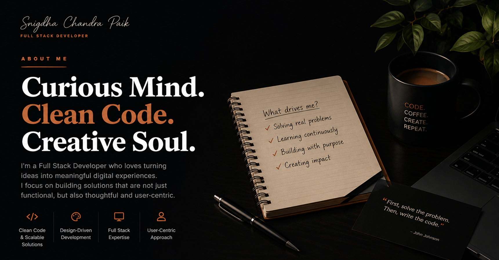
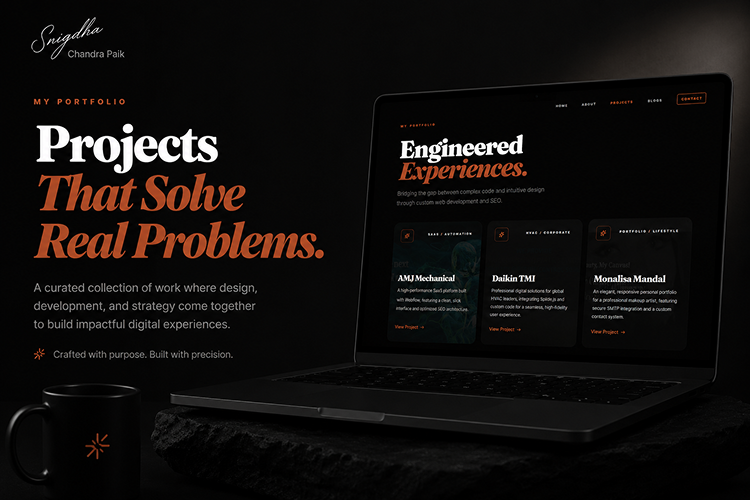
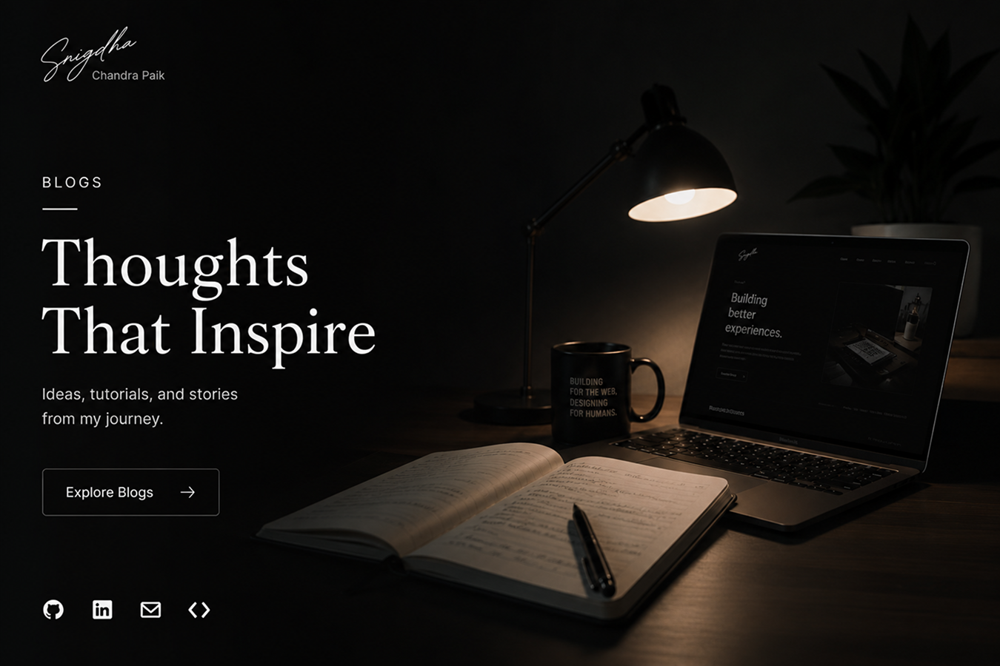

<div align="center">
  

  <h1>Snigdha Chandra Paik</h1>

  <p>
    <strong>Frontend Developer · SEO Specialist · Creative Engineer</strong><br/>
    Animated Next.js, Three.js & React Native portfolio engineered for Core Web Vitals and search visibility.
  </p>

  <p>
    <a href="https://snigdhachandrapaik.vercel.app">Live site</a>
    &nbsp;·&nbsp;
    <a href="https://snigdhachandrapaik.vercel.app/projects">Projects</a>
    &nbsp;·&nbsp;
    <a href="https://snigdhachandrapaik.vercel.app/blogs">Journal</a>
    &nbsp;·&nbsp;
    <a href="https://snigdhachandrapaik.vercel.app/contact">Contact</a>
  </p>

  <p>
    
    
    
    
    
    
    
  </p>
</div>

---

## Overview

The personal portfolio of **Snigdha Chandra Paik** — a solo frontend and SEO developer from South 24 Parganas, West Bengal. Built as a flagship of the same craft offered to clients: animated, fast, semantically structured, and built to rank.

Shipped client work includes Daikin TMI, AMJ Mechanical, The House of Abigail, The British Stripe Co. and Puribazar — the projects gallery is the canonical source of truth.

## Preview 

<table>
  <tr>
    <td align="center" width="50%">
      <br/>
      <sub><b>Home</b> — animated hero, magnetic cursor, gas-glow lighting</sub>
    </td>
    <td align="center" width="50%">
      <br/>
      <sub><b>About</b> — fluid particle simulation on canvas</sub>
    </td>
  </tr>
  <tr>
    <td align="center" width="50%">
      <br/>
      <sub><b>Projects</b> — 11 case studies, image-on-top cards</sub>
    </td>
    <td align="center" width="50%">
      <br/>
      <sub><b>Journal</b> — newspaper-edition blog layout</sub>
    </td>
  </tr>
</table>

## Features

- **Universal animated loader** — split-curtain reveal on cold load (2.2s) and route transitions (0.9s)
- **Magnetic hero card** with mouse-tracking parallax and gas-glow lighting
- **Fluid particle simulation** on the About page (canvas-based, 60fps)
- **Newspaper-edition** blog index with intersection-observer infinite scroll
- **Magazine-grade project cards** with floating category chips and full tech stack on each card
- **Magnetic contact button** with spring-based pull strength
- **Smooth-scroll** powered by Lenis
- **Type-safe** end-to-end with TypeScript and Next.js 16's typed routes

## SEO architecture

This is the same structural SEO offered to clients, applied to the portfolio itself.

| Layer | What ships |
|---|---|
| **Meta** | Per-page `title` (30–50 chars) + `description` (120–150 chars), `metadataBase`, `alternates.canonical`, `hreflang: en-IN` |
| **Open Graph / Twitter** | 1200×630 OG images per route, `summary_large_image` Twitter cards, fallback to portrait headshots |
| **Robots** | `index, follow` with `max-image-preview: large`, `max-snippet: -1`; Google Search Console verification token preserved |
| **JSON-LD** | `Person`, `WebSite`, `ProfessionalService` (root layout); `BreadcrumbList`, `AboutPage`, `ContactPage`, `CollectionPage → ItemList`, `Blog → BlogPosting`, `FAQPage` (per route) |
| **Sitemap** | `app/sitemap.ts` emits static routes + dynamic blog slugs with `changeFrequency` and `priority` |
| **Robots.txt** | `app/robots.ts` with explicit `disallow: /api/, /admin/` |
| **Headings** | Exactly one `<h1>` per page, semantic `<article>` and `<ul>` markup on project cards |

All schemas validate against [validator.schema.org](https://validator.schema.org/) and Google's [Rich Results Test](https://search.google.com/test/rich-results).

## Tech stack

**Framework** — Next.js 16.2 (App Router, Turbopack, React Compiler), React 19.2, TypeScript 5
**Styling** — Tailwind CSS 4, custom design tokens, Fraunces + Playfair Display + Plus Jakarta Sans + Monsieur La Doulaise via `next/font`
**Animation** — Framer Motion 12, Lenis smooth scroll, custom Canvas2D fluid simulation
**3D** — Three.js (r183), React Three Fiber, Drei
**Content** — Local JSON for projects and blog posts, Sanity client wired for future CMS swap
**Forms** — Zoho Forms public endpoint, AJAX submission with optimistic UI
**Analytics** — Google Tag Manager (GTM-M225DLQQ), deferred via `next/script` with `strategy="afterInteractive"`
**Icons** — Lucide React, FontAwesome Brands & Solid
**Hosting** — Vercel (static prerender for 5 routes, on-demand SSR for `/blogs/[slug]`)

## Project structure

```
Snigdha-Chandra-Paik/
├── public/
│   ├── images/         Headshots + family/influence photography
│   ├── OG/             1200x630 Open Graph cards per route
│   ├── projects/       11 project thumbnails
│   ├── blogs/          Blog hero images
│   ├── hobbies/        About-page imagery
│   └── CV/             Downloadable resume PDF
├── src/
│   ├── app/
│   │   ├── layout.tsx          Root layout + global JSON-LD + universal loader
│   │   ├── page.tsx            Home (server)
│   │   ├── sitemap.ts          Dynamic XML sitemap
│   │   ├── robots.ts           robots.txt
│   │   ├── about/page.tsx      Server wrapper + AboutPage schema
│   │   ├── projects/
│   │   │   ├── page.tsx                Server wrapper + CollectionPage schema
│   │   │   └── ProjectsContent.tsx     Client UI (animated grid)
│   │   ├── blogs/
│   │   │   ├── page.tsx                Server wrapper + Blog schema
│   │   │   ├── BlogsContent.tsx        Client UI (newspaper layout)
│   │   │   └── [slug]/page.tsx         BlogPosting schema, async params
│   │   └── contact/
│   │       ├── page.tsx                Server wrapper + ContactPage schema
│   │       └── ContactContent.tsx      Client UI (magnetic button + form)
│   ├── components/
│   │   ├── home/               Hero, About, Tech, Projects, Hobbies, Blogs
│   │   ├── about/              Hero (fluid sim), Skills, Parents, Gurudev, Favorites
│   │   ├── Navbar.tsx
│   │   ├── Footer.tsx
│   │   ├── SmoothScroll.tsx    Lenis provider
│   │   ├── UniversalLoader.tsx Cold-load + route-change preloader
│   │   └── JsonLd.tsx          XSS-safe structured-data injector
│   ├── lib/
│   │   ├── seo.ts              Schema builders, SITE_URL constant
│   │   └── blogService.ts      Local JSON post fetcher
│   ├── data/
│   │   ├── projects.json       11 case studies
│   │   └── colors.json         Brand palette tokens
│   └── content/
│       └── posts.json          Local CMS content
├── next.config.ts              React Compiler + remote image patterns
├── tsconfig.json
└── package.json
```

## Local development

**Requirements** — Node.js 20.9+, npm 10+ (Next.js 16 minimum).

```bash
# Install
npm install

# Dev server (Turbopack, port 3000)
npm run dev

# Production build
npm run build

# Start production server
npm run start

# Lint
npm run lint
```

Open <http://localhost:3000> and edit `src/app/page.tsx` — hot reload covers all routes.

## Adding a project

Append a new entry to [`src/data/projects.json`](src/data/projects.json). The Home `Selected Works` grid auto-shows entries with `featured: true`; the `/projects` page lists every entry. Drop the thumbnail into `public/projects/` first.

```json
{
  "id": 12,
  "title": "Your Project",
  "description": "One-sentence pitch focused on the outcome, not the tech.",
  "category": "Category / Subcategory",
  "tech": ["Next.js", "TypeScript", "Tailwind"],
  "image": "/projects/your-image.png",
  "link": "https://your-project.com/",
  "featured": true,
  "colorKey": "ai"
}
```

### Field reference — projects

| Field | Type | Required | What it does |
|---|---|---|---|
| `id` | number | yes | Unique integer; sort order in the grid. Increment from the highest existing id. |
| `title` | string | yes | Displayed in the project card heading and `CreativeWork.name` in JSON-LD. |
| `description` | string | yes | 1–2 sentences. Shown under the title on `/projects` and on hover in the Home Selected Works section. Becomes `CreativeWork.description` in schema. |
| `category` | string | yes | Short label shown in the floating chip on the image, e.g. `"E-Commerce / Fashion"`, `"Agritech / AI Platform"`. |
| `tech` | string[] | yes | Tech-stack pills rendered on every project card. Also becomes `CreativeWork.keywords` (comma-joined) in JSON-LD. |
| `image` | string | yes | Path under `public/`, starting with `/`. Recommended 1200×750 (16:10) for the card hero. |
| `link` | string | yes | Live URL — opens in a new tab with `rel="noopener"`. Used as `CreativeWork.url`. |
| `featured` | boolean | yes | `true` → appears in the Home `Selected Works` section as well. `false` → only on `/projects`. |
| `colorKey` | string | yes | Theme accent token, currently one of `"webflow"`, `"wordpress"`, `"shopify"`, `"ai"` (see [`src/data/colors.json`](src/data/colors.json)). |

The sitemap, `CollectionPage → ItemList` JSON-LD, Home grid, and `/projects` page update automatically on the next build.

## Adding a blog post

Append to [`src/content/posts.json`](src/content/posts.json) — slug becomes the URL at `/blogs/<slug>`. Drop the hero image into `public/blogs/` first.

```json
{
  "id": "02",
  "slug": "your-post-slug",
  "title": "Your Visible Post Title",
  "metaTitle": "Keyword-rich SEO Title Under 50 Chars",
  "metaDescription": "Compelling 140–150 char meta description with target keywords near the front and a clear value prop for searchers.",
  "category": "TECH",
  "date": "2026-05-20",
  "image": "/blogs/your-image.png",
  "excerpt": "Visible card excerpt shown in the blog listing.",
  "content": "<p>HTML content with <h2>, <h3>, <ul>, <table>, etc.</p>"
}
```

### Field reference — blog posts

| Field | Type | Required | What it does |
|---|---|---|---|
| `id` | string | yes | Two-digit volume number (`"01"`, `"02"` …) displayed as `VOL. 01` next to the post in the index. |
| `slug` | string | yes | URL segment at `/blogs/<slug>`. Use lowercase kebab-case. Must be unique. Also keys the `<link rel="canonical">`. |
| `title` | string | yes | Visible `<h1>` on the post page and the heading shown in the blog index. Used as `BlogPosting.headline` in JSON-LD. |
| `metaTitle` | string | optional | Used as the `<title>` tag, `og:title`, `twitter:title` and `BlogPosting.name`. Falls back to `title` if omitted. Aim for 30–50 chars. |
| `metaDescription` | string | optional | Used as `<meta name="description">`, `og:description`, `twitter:description` and `BlogPosting.description`. Falls back to `excerpt` if omitted. Aim for 130–150 chars. |
| `category` | string | yes | Short uppercase label (`"TECH"`, `"SEO"`, `"DESIGN"`). Drives the related-posts logic at the bottom of every post. |
| `date` | string (ISO) | yes | `YYYY-MM-DD`. Used in the post header, sitemap `lastModified`, and `BlogPosting.datePublished` / `dateModified`. |
| `image` | string | yes | Path under `public/`, starting with `/`. Recommended 21:9 (e.g. 1200×514) for the post header. Also used as `og:image` and `BlogPosting.image`. |
| `excerpt` | string | yes | Visible preview shown on `/blogs`. SEO fallback if `metaDescription` is missing. |
| `content` | string (HTML) | yes | The post body, rendered via `dangerouslySetInnerHTML`. Use `<h2>` for sections (auto-extracted into the sidebar Outline TOC), `<h3>` for sub-sections, plus `<p>`, `<ul>`, `<table>`, `<strong>`, `<em>`. Word count auto-derived for `BlogPosting.wordCount`. |

The slug page emits a full `BlogPosting` JSON-LD block, the `/blogs` index updates its `Blog → blogPost[]` schema, and the sitemap picks up the new URL — all on the next build.

## Deployment

Pushes to `main` deploy automatically to Vercel. The site uses static prerendering for `/`, `/about`, `/projects`, `/blogs`, `/contact`, plus on-demand server rendering for `/blogs/[slug]`. `sitemap.xml` and `robots.txt` are generated at build time.

After deploy, resubmit `https://snigdhachandrapaik.vercel.app/sitemap.xml` in Google Search Console.

## Author

**Snigdha Chandra Paik**
South 24 Parganas, West Bengal, India — 743395

<p>
  <a href="mailto:snigdhachandrapaik@gmail.com">snigdhachandrapaik@gmail.com</a> &nbsp;·&nbsp;
  <a href="tel:+918391879168">+91 8391879168</a><br/>
  <a href="https://www.facebook.com/snigdha.chandra.paik">Facebook</a> &nbsp;·&nbsp;
  <a href="https://www.instagram.com/snigdha_chandra_paik/">Instagram</a> &nbsp;·&nbsp;
  <a href="https://github.com/snigdha-project">GitHub</a> &nbsp;·&nbsp;
  <a href="https://wa.me/918391879168">WhatsApp</a>
</p>

Available for frontend, Next.js, Three.js, React Native, animation, automation and SEO projects. Replies within 24 hours.

## License

Source is provided for reference. Brand assets, photography, copy and the personal name "Snigdha Chandra Paik" remain the property of the author and may not be reused.
